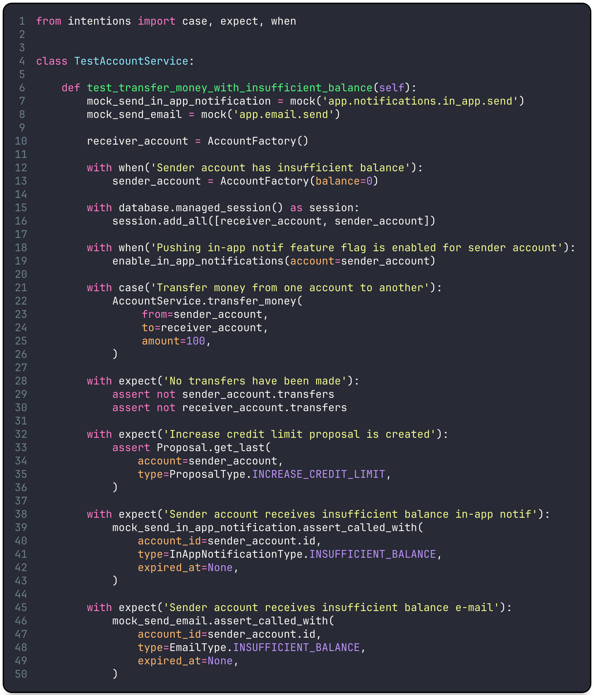

RSpec-inspired BDD-like syntax sugar to force software engineers writing descriptive test cases and express explicit intentions.

[](https://github.com/dmytrostriletskyi/intentions/actions/workflows/main.yaml)
[](https://github.com/dmytrostriletskyi/intentions/releases)
[](https://pypi.python.org/pypi/intentions)

[](https://pepy.tech/project/intentions)
[](https://pypi.python.org/pypi/intentions/)
[](https://pypi.python.org/pypi/intentions/)



Table of content:

* [Introduction](#introduction)
* [Motivation](#motivation)
* [Getting Started](#getting-started)
  * [How to Install](#how-to-install)
  * [Usage](#Usage)

## Introduction

`intentions` is a `Python` library providing syntax sugar to force software engineers writing descriptive test cases, 
express explicit intentions and facilitate test-driven and behavior-driven development.

Behavior-driven development is an approach in software development that emphasizes the behavior of an application for 
business needs. Each feature is describe in with the following structure: initial context or setup (data, factories), 
event or action (function execution, API call), expected outcome or result.

Unlike many other testing libraries, `intentions` is not a test runner and not even a plugin. It is just a set of 
constructs that helps defining a structure of any test on any framework and runner.

## Motivation

Using `intentions`, it benefits you by:

* Making collaboration between developers, testers, and business stakeholders easier.
* Double-checking descriptions match wordings of variables and function names.
* Introducing a common language for communication and understanding.
* Enabling the behavior-driven development mindset to colleges.
* Additional focus on the expected behavior or outcomes.
* Minimizing the learning curve for new joiners.
* Reducing uncertainties.

In the same time you are not required to use it everywhere, even in the single test you are able to define which
constructs to use and how many of them. For instance, you can skip it for unit tests and only use for integration tests.

## Getting Started

### How to install

Install the library with the following command using `pip3`:

```bash
$ pip3 install intentions
```

### Usage

There are 3 constructs provided:

* `when` to emphasize the part of the test case that sets up the initial data or state before the action or event occurs.
* `case` to emphasize the action or event that triggers the test case.
* `expect` to emphasize the expected outcome or result after the action has taken place.

For `when`, it describes the conditions needed for the scenario to be meaningful. Important to use this construct to 
emphasize exactly specific condition of the test case. As you see on the example below, the construct is used only
on a specific scenario when a user from the UK has not uploaded the document yet, but it's already going to be submitted 
to the review.

```python
from intentions import when


class TestDocumentVerificationService:
  
  def test_verify_document_when_not_uploaded_user_from_uk(self):
      admin = UserFactory(is_admin=True)
      verification = VerificationFactory()
      
      ...
    
      with when('User is from the United Kingdom'):
          user = UserFactory(country=Country.UK)

      with when('User document is blurred'):
          user_document = Document(
              user=user,
              verification=verification,
              status=DocumentStatus.TO_BE_UPLOADED,
          )

      ...
```


For `case`, it describes the specific action that the user or system takes. Important to use this construct to 
emphasize exactly the function you are testing. As you see on the example below, the construct is used only for
verification document method of its class having many other functions such as mocks, data preparation and side functions
in the test alongside that can make what actually triggers everything less understandable.

```python
from intentions import case


class TestDocumentVerificationService:
  
  def test_verify_document_when_not_uploaded_user_from_uk(self):
      ...
      
      mock_verification_api_response = prepare_verification_api_response()
      mock_document_verification_api_request = mock(
          path='api.document_verification.request',
          data=mock_verification_api_response,
      )
      
      enable_async_requests()
      create_user_kyc_profile()

      with case('Verify a document'):
          document_verification = DocumentVerificationService.verify_document(
              document=document, 
              user=user, 
              admin=admin,
          )
```

For `expect`, it describes the expected behavior or change in the system. Important to use this construct to emphasize 
different groups of different expectations and exactly behavior.

```python
from intentions import expect


class TestDocumentVerificationService:
  
  def test_verify_document_when_not_uploaded_user_from_uk(self):
      ...
      
      with expect('User document is not verified by admin'):
          assert document_verification.user == user
          assert document_verification.admin == admin
          assert not document_verification.is_completed
          assert not document_verification.is_completed

      with expect('Document verification provides errors'):
          assert 'Document is not uploaded' in document_verification.errors

      with expect('Document was sent to verification API'):
          mock_document_verification_api_request.assert_called() 
```
